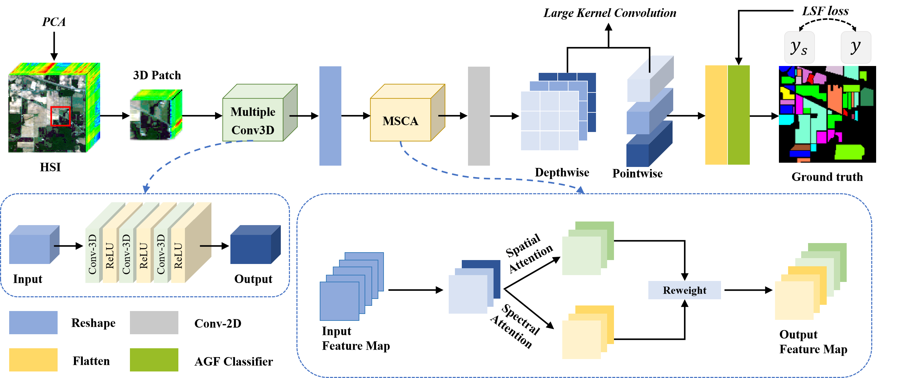

# Hyper-LKCNet: Exploring the Utilization of Large Kernel Convolution for Hyperspectral Image Classification
<p align="center"><strong>IEEE Journal of Selected Topics in Applied Earth Observations and Remote Sensing, 2025</strong></p>

**Authors:** [Rong Liu](https://scholar.google.cz/citations?hl=zh-CN&user=R7SPwqEAAAAJ), [Zhilin Li](https://scholar.google.cz/citations?hl=zh-CN&user=WvvhxaEAAAAJ), [Jiaqi Yang](https://scholar.google.com/citations?user=cQAAdBYAAAAJ&hl), Jian Sun and [Quanwei Liu](https://scholar.google.com/citations?user=E-loHKYAAAAJ&hl=en)

**Paper Link:** https://ieeexplore.ieee.org/document/11007459

---

## 🌞 Model


<p align="center"><b>Figure 1.</b> Flowchart of the proposed framework.</p>

## 🛠️ Installation

- [Anaconda 2.7](https://www.anaconda.com/download/#linux)
- [Keras 2.3.0](https://github.com/keras-team/keras)
- [tensorflow 1.13.1](https://pypi.org/project/tensorflow/1.13.1/)

## 📦 Data preparation
The dataset needs to be downloaded and placed in the project's `data` folder. The example is as follows:

| Dataset name | File name                                              | Remark                    |
|------------|------------------------------------------------------|-------------------------|
| KSC        | `KSC.mat`, `KSC_gt.mat`                              | Kennedy Space Center   |
| PU         | `PaviaU.mat`, `PaviaU_gt.mat`                        | Pavia University       |
| IP         | `Indian_pines_corrected.mat`, `Indian_pines_gt.mat` | Indian Pines           |
| LK         | `WHU_Hi_LongKou.mat`, `WHU_Hi_LongKou_gt.mat`        | WHU_Hi_LongKou     |

Please make sure the data files are located in the `data` folder in the project root directory.

## 🔧 Usage
1. Install the dependent libraries required by the project
2. Clone this repo
```bash
git clone https://github.com/liurongwhm/Hyper-LKNet.git
```
 3.Prepare the data set and other parameter settings

 4.Training and Testing
```bash
python main.py 
```
## 📝 Citation
If you find our paper helpful, please give a ⭐ and cite it as follows:
```bash
@ARTICLE{11007459,
  author={Liu, Rong and Li, Zhilin and Yang, Jiaqi and Sun, Jian and Liu, Quanwei},
  journal={IEEE Journal of Selected Topics in Applied Earth Observations and Remote Sensing}, 
  title={Hyper-LKCNet: Exploring the Utilization of Large Kernel Convolution for Hyperspectral Image Classification}, 
  year={2025},
  volume={},
  number={},
  pages={1-17},
  keywords={Convolution;Kernel;Feature extraction;Transformers;Hyperspectral imaging;Adaptation models;Image classification;Convolutional neural networks;Computational efficiency;Data models;Hyperspectral image classification;large kernel convolution;attention mechanism;imbalanced data},
  doi={10.1109/JSTARS.2025.3571954}}
```
# 📖 Relevant Projects

[1] <strong>Dual Classification Head Self-training Network for Cross-scene Hyperspectral Image Classification, arxiv, 2025</strong> | [Paper](http://arxiv.org/abs/2502.17879)
<br><em>&ensp; &ensp; &ensp; Rong Liu, Junye Liang, Jiaqi Yang, Jiang He, Peng Zhu</em>